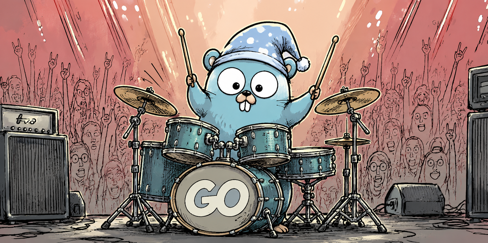

<div align="center">
  
    <h1>Vimo</h1>
  <p><em>
基于 Go 编写的 AI Chat 交互 TUI，使用 Sqlite 实现 OpenAI Memory 机制，快速启动，无模块加载耗时，无需任何环境配置</em></p>
</div>

## 特点

1. 内置的skill
- xxx
- xxx
- xxx
- xxx
- xxx

2. 内置了三层上下文压缩
- 工具结果剔除
- 本地 Markdown 摘要替换
- LLM级别摘要

3. 内置工具调用
- Shell 命令
- Git 命令 （diff、log、status）
- 技能加载
- 文件读写
- Grep 搜索
- sequentialthinking （逐步思考）
- 网络搜索 （配置Key，优先 Exa，降级 Parallel，降级 DuckDuckgo）
- 浏览器自动化 （配置Key，需要 Browserbase Cloud 账号）
  
4. 功能
- 新建对话
- 清空对话
- 历史记录保存
- 主动压缩对话
- MCP 配置
- Skill 添加
- 管理工具
- 主模型和辅助模型设置
- 增强提示词

## 快速开始
无需任何环境，直接运行
```
vimo.exe
```

## 使用指南
| Action | Shortcut |
| :--- | :--- |
